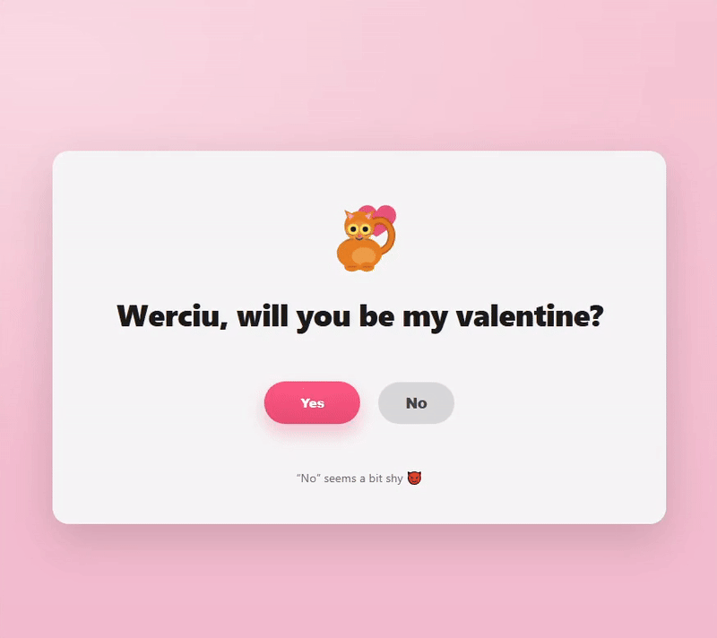

# 💖 Interactive Valentine Card Template

A professional, highly customizable "Will you be my valentine?" card. This project is designed as a **template**, allowing anyone to create their own personalized card in seconds by editing a single configuration object.

## ✨ Features

*   **Easy Personalization**: Change names, texts, and memes at the top of the file.
*   **Surprise Interaction**: A playful "No" button that starts static and begins dodging the cursor only after the first interaction.
*   **Dynamic Meme Integration**: Simply paste a Tenor GIF ID to update the success screen.
*   **Responsive & Modern**: Built with vanilla JS and CSS variables, works perfectly on mobile and desktop.

## 🛠️ How to Customize (The "White-Label" Way)

You don't need to dig through the HTML structure. Everything you need is in the `CONFIG` block at the top of `index.html`:

1.  **Open `index.html`** in your favorite code editor (like VS Code, Notepad++, or even a simple text editor).
2.  **Locate the `CONFIG` object** (around lines 10-30). It looks like this:

    ```javascript
    const CONFIG = {
      valentineName: "Werciu,",                 // Change to your valentine's name
      questionText: "will you be my valentine?",// The question
      yesButtonText: "Yes",                     // Text on the YES button
      noButtonText: "No",                       // Text on the NO button
      hintText: "“No” seems a bit shy 😈",      // Hint text at the bottom
      successTitle: "YAY! 🎉",                  // Title shown after clicking YES

      // Tenor GIF ID (from Tenor URL)
      tenorGifId: "13759391442761662032",       // Paste any Tenor GIF ID here

      // ... other technical settings (you can leave these as they are)
    };
    ```

3.  **Change the Name**: Update the text inside the quotes for `valentineName` to whoever you're asking (e.g., `"Moja Walentynko,"`).
4.  **Change the Question/Texts**: Modify `questionText`, `yesButtonText`, `noButtonText`, `hintText`, and `successTitle` to your liking.
5.  **Change the Meme**: 
    *   Go to [Tenor.com](https://tenor.com).
    *   Find a GIF you love.
    *   Copy the ID from the end of the URL (e.g., if the URL is `tenor.com/view/cat-gif-12345`, the ID is `12345`).
    *   Paste this ID into `tenorGifId` (e.g., `tenorGifId: "12345"`).
6.  **Save and Run**: Save the `index.html` file and open it in your web browser to see your personalized card!

## 📦 Deployment

This project is perfectly suited for **GitHub Pages**, making it incredibly easy to share your personalized card with the world:

1.  **Create a new repository** on GitHub.
2.  **Upload your `index.html` file** to the root of this new repository.
3.  Go to your repository's **Settings > Pages** and enable GitHub Pages, selecting the `main` branch (or `master`) as the source.
4.  **Share the generated link** with your valentine!

## 💡 Inspiration

This project was inspired by a viral TikTok trend, aiming to recreate the playful and engaging experience of an interactive Valentine's Day card in a customizable web format.


